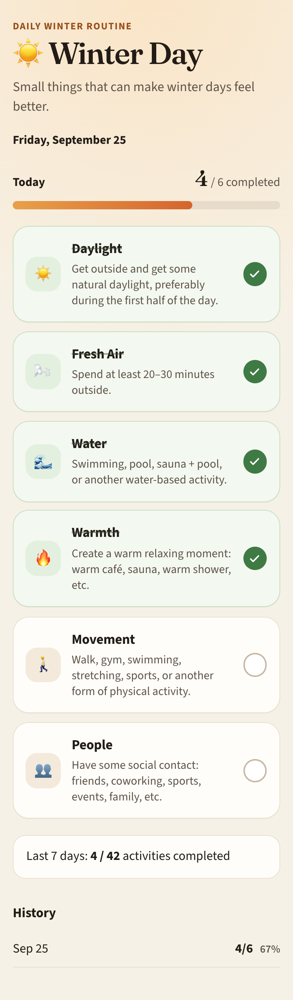

# Winter Day

A small daily checklist for dark, cold winter days. Open it, mark what you did, and start fresh the next morning.

It is a personal routine, not a medical program. Checking the list does not promise a change in how you feel.



Each day includes daylight, fresh air, water, warmth, movement, and time with people. Progress, a short history, and a 7-day total stay in this browser. There is no account and no server.

Live app: https://winter-day-zeta.vercel.app

## Run locally

```bash
npm install
npm run dev
```

`npm test` checks the checklist math and saved data. `npm run build` makes the production bundle.
